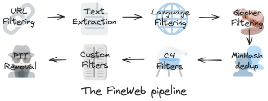

# Example introduction: Hugging Face with FineWeb dataset
During the preprocessing of the model, Hugging Face constructed a web dataset called FineWeb. The purpose of this dataset is to aggregate a large amount of high-quality textual data covering a wide range of topics and styles in order to provide a rich corpus to support the training of the model. The wide range of data sources for FineWeb ensures that the model is well adapted to processing text from different domains.

# Dataset
## The purpose of Dataset
The main purpose of the dataset is to provide the model with a diverse and representative text base that enables it to understand and generate natural language. By analyzing and learning from this data, LLM is able to demonstrate increased intelligence and flexibility in tasks such as dialog, Q&A, and text generation.
## Finding the raw data
A common question often asked regarding web datasets used to train LLMs is “where do they even get all that data?”. There are generally two options:

- you either crawl it yourself, like companies such as OpenAI or Anthropic (among others) do (see here and here)
- you use a public repository of crawled webpages, like the one maintained by the non-profit CommonCrawl

To build FineWeb, following what has been done in the past by a number of LLM training teams, we used CommonCrawl (CC) as a starting point. The Common Crawl non–profit organization has been crawling the web since 2007 and releases a new crawl containing 200 to 400 TiB of textual content obtained via automatic web crawling usually every 1 or 2 months.

As an example, the latest CC crawl (April 2024) contains 2.7 billion web pages, totaling 386 TiB of uncompressed HTML text content. Ninety-six crawls have been released since 2013 and 3 crawls from 2008 to 2012, which are in a different (older) format.

# How to produce the dataset

## 1.Text extraction
CommonCrawl data is available in two main formats: WARC and WET. WARC (Web ARChive format) files contain the raw data from the crawl, including the full-page HTML and request metadata. WET (WARC Encapsulated Text) files provide a text only version of those websites.

A large number of datasets take the WET files as their starting point. In our experience the default text extraction used by Common Crawl to create these WET files is suboptimal for the goals of LLM pretraining and there are a variety of open-source libraries that provide better text extraction. We extracted the text content from the WARC files using the trafilatura library, which from visual inspection of the results provided good quality extraction when compared to other libraries.

## 2.Base filtering
Filtering is an important part of the curation process. It consists in removing part of the data (be it words, lines, or even full documents) that lowers the performance of the model and is thus deemed to be “lower quality” in our eval-driven process of dataset crafting.

As a basis for our filtering we used part of the setup from RefinedWeb. Namely, we:

- Applied URL filtering using a blocklist to remove adult content
- Applied a fastText language classifier to keep only English text with a score ≥ 0.65
- Applied quality and repetition filters from MassiveText (using the default thresholds)

After applying this filtering to each of the text extracted dumps (there are currently 96 dumps) we obtained roughly 36 trillion tokens of data.

## 3.Deduplicating the data
Deduplication is one of the most important steps when creating large web datasets for LLM pretraining. Methods to deduplicate datasets attempt to identify and remove redundant/repeated data from the dataset.

### WHY DEDUPLICATE?
The web has many aggregators, mirrors, templated pages or just otherwise repeated content spread over different domains and webpages. Sometimes, these duplicated pages can even be introduced by the crawler itself, when different links point to the same page.

Removing these duplicates (deduplicating) has been correlated with improvements in model performance and a reduction in memorization of pretraining data, which might allow for better generalization. Additionally, the performance uplift obtained through deduplication can be equated to increased training efficiency: by removing duplicated content, a model can reach the same performance level with fewer training iterations – or equivalently, for a given number of training tokens, a model will have seen more diverse data.

There are different ways to identify and even define duplicated data. Common approaches rely on hashing techniques to speed up the process, or on building efficient data structures to index the data (like suffix arrays). Methods can also be “fuzzy”, by using some similarity metric to mark documents as duplicates, or “exact” by checking for exact matches between two documents (or lines, paragraphs, or whatever other granularity level being used).

### MINHASH ALGORITHM (OPTIONAL)
MinHash de-duplication is an efficient technique for identifying and removing duplicate data and is widely used in text, document and other aggregate data. It utilizes MinHash algorithm to improve the efficiency of data processing by comparing the similarity between collections by approximation. It estimates the Jaccard similarity between sets by generating multiple hash values for each set. Jaccard similarity is defined as the ratio of the size of the intersection of two sets to the size of the concatenation of the sets with the following formula:

$$
J(A,B) = \frac{|A \cap B|}{|A \cup B|}
$$

### DEDUPLICATION PROGRESS (Optional)
1.Generate MinHash Signature

Apply multiple hash functions to each collection (document) to generate MinHash signatures. Each signature consists of multiple hash values.

2.Compare Signatures

Use signatures to compare similarities between collections. Similarity can be estimated by calculating the Hamming distance between signatures.

3.Threshold Judgment

Set a similarity threshold above which collections are considered duplicates. The choice of this threshold is usually based on the needs of a specific application.

4.De-duplication

Remove duplicates with similarity higher than the threshold and keep only one instance to reduce data redundancy.

## 4.PII Removal
### What is PII Removal?
In today’s digital world, our personal information proliferates online. There are a multitude of data brokers collecting this personal data about millions of people, including full names, home and email addresses, phone numbers, income and medical information, and much more. Ongoing monitoring and removal of this PII from broker sites and Google searches protects the executive, employee, and the organization from cyber and physical threats.

### Why is PII Removal important?
With PII readily available through a Google search or visible to threat actors on a data broker site, organizations are at increased risk of phishing, social engineering attacks, doxxing, swatting, and impersonation risks. Phishing alone accounts for almost one-third of all data breaches. Removing this PII hardens your organization’s attack surfaces, reduces your breach risks, and protects your executives and employees.

