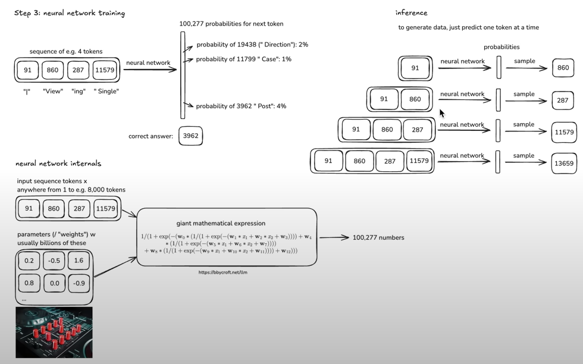

# What is a Neural Network?
## Defination
A neural network is a computational model that simulates the workings of the human brain and is designed to solve a variety of complex problems, especially in the fields of image recognition, natural language processing, and speech recognition. We can imagine a neural network as a network of interconnected "neurons" that work like cells in the brain.

## Basic Structure

**1. Neurons:**
   The basic units of a neural network, similar to biological neurons. Each neuron receives input, performs a computation, and passes the result to other neurons.

**2. Layered Architecture:**
Neural networks typically consist of multiple layers, including an input layer, hidden layers, and an output layer. The input layer receives data, hidden layers extract features, and the output layer generates the final result.

**Example：**
In an image recognition neural network, the input layer neurons function like pixel perception units of the eyes, receiving the raw pixel information of an image. The numerous hidden layers in between resemble the deep thinking regions of the brain, processing and refining this information at multiple levels. The output layer ultimately provides a judgment, identifying whether the object in the image is a cat, a dog, or something else.
## Neural Network I/O

In the input and output mechanism of a neural network, the input data allows the model to predict the next output value, which can have thousands of possible outcomes. The network calculates its likelihood for each outcome and outputs these probability values. The model then compares the most probable prediction with the actual correct answer and adjusts the internal parameters based on this comparison to improve the accuracy of future predictions.

## Inside the Neural Network

Inside a neural network, input data is combined with a series of parameters to produce tens of thousands of possible outcomes through an activation function. The network constantly adjusts these parameters to optimize the performance of the model based on the error between the actual output and the predicted outcome. This process allows the neural network to learn complex patterns and adapt to different task requirements.

# Neural Network Training Process
 **1. Initialization**

Start by initializing the weights and biases of the network. These are typically set to small random values to break symmetry and ensure that neurons learn different features.

**2. Forward Pass**

Input data is passed through the network, and the output is computed using the current weights and biases. This process involves several layers, where each layer applies a transformation to the data.

**3. Loss Calculation**

The difference between the predicted output and the actual output (ground truth) is calculated using a loss function. Common loss functions include:

  **(i) Mean Squared Error (MSE)**: Often used for regression tasks.

  **(ii) Cross-Entropy Loss**: Commonly used for classification tasks.

**4. Backpropagation**

The gradients of the loss function with respect to each weight and bias are computed using the backpropagation algorithm. This involves:
  (i) Applying the chain rule of calculus to propagate the error backwards through the network.
  (ii) Updating gradients at each layer based on the computed loss.

**5. Parameter Update**

The weights and biases are updated using an optimization algorithm, such as:

  **(i) Gradient Descent**: The most basic method, where the parameters are updated in the opposite direction of the gradient.

  **(ii) Variants**: Stochastic Gradient Descent, Adam, and others that enhance convergence speed and stability. 

**6. Iteration**

Steps 2-5 are repeated for multiple epochs (complete passes through the training data) until the model's performance converges to a satisfactory level. Monitoring performance metrics during training can help in deciding when to stop.

# Challenges in Neural Network Training

**1. Overfitting**  
The model performs well on training data but poorly on unseen data. Techniques to mitigate overfitting include:

(i) Dropout: Randomly setting a fraction of the neurons to zero during training.  
(ii) Regularization: Adding a penalty term to the loss function to discourage complexity.  
(iii) Early Stopping: Halting training when the validation loss starts to increase.

**2. Vanishing/Exploding Gradients**  
In deep networks, gradients may become very small (vanishing) or very large (exploding), posing challenges for training. Solutions include:

(i) Using appropriate activation functions (e.g., ReLU or Leaky ReLU).  
(ii) Implementing batch normalization to keep activations within a certain range.

**3. Computational Resources**  
Training large neural networks requires significant computational power and memory. 
We need to utilize GPUs/TPUs. These specialized processors can accelerate matrix operations and reduce training time significantly.

# Practical Tips for Effective Training

By implementing the following strategies and being mindful of potential challenges, you can train neural networks more effectively and efficiently.

**1. Data Augmentation**  
Increase the diversity of your training data by applying transformations (e.g., rotation, flipping for images) to improve model generalization.

**2. Learning Rate Scheduling**  
Adjust the learning rate during training to balance between fast convergence and stability. Techniques include:  
  (i) Reducing the learning rate over time.  
  (ii) Using adaptive learning rate methods.

**3. Batch Normalization**  
Normalize the inputs of each layer to stabilize and speed up training, helping to alleviate internal covariate shift.

**4. Cross-Validation**  
Use cross-validation techniques to ensure that model performance is robust across different subsets of the data.

**5. Model Checkpointing**  
Save model weights at regular intervals, allowing for recovery or further tuning without starting from scratch.

# Application Areas

Neural networks are widely used in various fields, including:

**1. Image Recognition:** For image classification and object detection.

**2. Natural Language Processing:** For text generation, translation, and sentiment analysis.

**3. Audio Processing:** For speech recognition and music generation.

By learning patterns from large amounts of data, neural networks can make predictions, classify information, and generate content, demonstrating powerful intelligence capabilities.

# Example 
## Demonstration of the GPT LLM
1. GPT (Generative Pre-trained Transformer) is a state-of-the-art natural language processing model capable of generating coherent and context-sensitive texts.
2. Experience GPT: By clicking [LLM Visualization](https://bbycroft.net/llm), you can learn more about the workflow of GPT and experience its powerful text generation capabilities.
