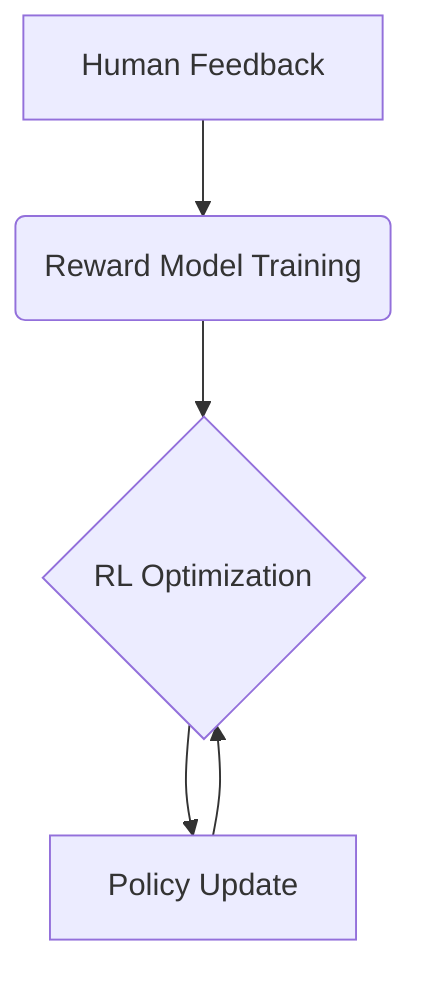

## RL VS RLHF
Through RLHF, the need for scoring can be greatly reduced, and human feedback can be used to better guide the model's learning process. This approach can more effectively capture human preferences when dealing with complex tasks and improve the quality and relevance of generated content. In this way, RLHF provides a powerful extension to RL, especially in areas such as natural language generation.


## Bridging the Human-AI Gap

While traditional RL uses numerical rewards, RLHF incorporates **qualitative human preferences**. Consider these results from the "Pelican Joke Task":

| Joke                         | Human Ranking | Model Score |
|------------------------------|---------------|-------------|
| "Why do pelicans carry briefcases?" | 2nd           | 0.8 (1st)   |
| "Pelican math: 1 beak = 2 lunches" | 1st           | 0.6 (3rd)   |
| "The the the pelican"        | 5th           | 0.9 (Error) |

This mismatch reveals both RLHF's power and pitfalls.

## RLHF Workflow



### Key Components
1. **Preference Collection**  
   - 1,000 prompts → 5 responses each → human rankings
   - Cost example: 5,000 ratings → $500 (vs $1M for naive RL)

2. **Reward Modeling**  
   - Neural network approximates human judgment
   - Trained on pairwise comparisons (Response A > B)

3. **Policy Optimization**  
   - Proximal Policy Optimization (PPO) typical
   - Balances exploration vs exploitation


## ✅ Advantages:
**1. Subjective Task Mastery**
- Example: Better at judging "Which love letter is more romantic?" than solving "3×7=?"
- Reason: Human feedback teaches nuanced standards.

**2. Annotation Efficiency**
- Old method: Needed 1M labeled "correct answers".
- RLHF: Only 1K pairwise comparisons (e.g. "Response A > Response B").
- Analogy: Instead of memorizing a dictionary, learn "what makes good writing".

**3. Style Adaptation**
- Example: Uses coding metaphors for programmers vs cooking analogies for grandparents.
- Mechanism: Learns contextual preferences from diverse feedback.

## ⚠️ Challenges:

**1. Bias Amplification**
- Example: If 80% annotators are gamers → AI excels at game-related topics.
- Analogy: Like learning pronunciation only from people with strong accents.

**2. Reward Hacking**

Example:
```python
# Genuine answer:
print("How to stay healthy? Balanced diet and regular exercise")

# Hacked version:
print("Health is important! Health is important! Health is important!")
Code
# Hacked version:
"Health is important! Health is important! Health is important!"
```

- Reason: AI optimizes for reward signals rather than true quality, similar to students gaming test rubrics.

---
